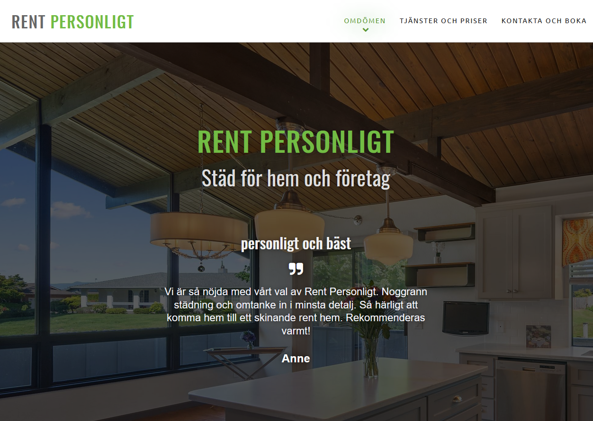

## Cleaning company Website

Website made for a local cleaning service company. Live version can be found [here](https://www.rentpersonligt.com/).

### Design
Made very barebones and from scratch using HTML, SCSS, JavaSript and a little bit of PHP, running on an Apache host. 

Page sliding effect is created with JavaScript. Free stock photos are taken from [Unsplash](https://unsplash.com/images/stock). [Oswald](https://fonts.google.com/specimen/Oswald) is the font of choice for headings.

### Tools
[Visual Studio Code](https://code.visualstudio.com/) 

[InkScape](https://inkscape.org/)

### Preview

 
